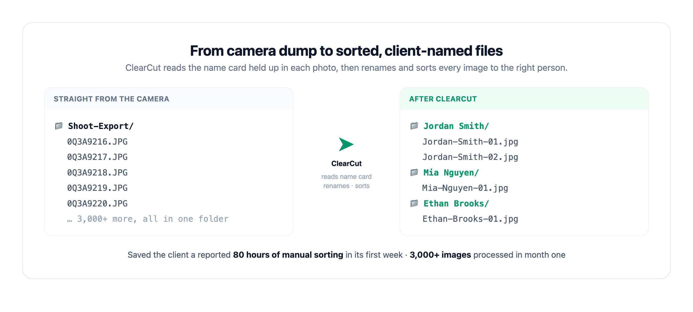

# ClearCut

**AI photo automation for high-volume sports and event photographers.**

ClearCut takes a full shoot straight off the camera and returns finished, client-ready files: backgrounds removed, every image renamed to the right person, and everything sorted into per-client folders. What used to be a full weekend of manual editing and sorting happens in one automated pass.

> This is a public overview of the product. The source code is private client work and is not published here.

## The problem

A single youth-sports or team shoot can produce thousands of frames, all with camera filenames like `0Q3A9216.JPG`, dumped into one folder. Before ClearCut, matching each photo to the right athlete, renaming it, and cutting out the background was hours of tedious manual work per shoot.

## What ClearCut does

- **Reads the name card in every photo.** Each athlete holds up a name card at the start of their set. A computer-vision pipeline reads that card and uses it to label the frames that follow.
- **Renames and sorts automatically.** Every image is renamed to the correct client and filed into that person's folder, with no manual matching.
- **Removes backgrounds in bulk.** A computer-vision segmentation model cuts clean backgrounds off entire batches of high-resolution photos.
- **Batch-first uploads.** Drop in a single image, a folder, or a `.zip`, and watch real-time per-image progress.

## Results

- Saved a client a reported **80 hours of manual labor in its first week**.
- Processed **3,000+ images** in its first month.

## How it works

1. **Upload** a shoot as a folder or `.zip` through the web app.
2. **Segment.** Each image runs through a background-removal model for a clean cut-out.
3. **Read and match.** A vision step reads the name card in frame and assigns the following photos to that person.
4. **Rename and sort.** Files are renamed to the client and organized into per-client folders.
5. **Download** the finished, sorted set.

## Built with

Python, FastAPI, React, Supabase (Postgres and Storage), computer-vision APIs, Stripe, and Docker. The platform includes multi-user accounts, a credit system with reserve and refund on failure so failed images are never charged, and production billing.

## Status

In production and used for real client shoots. Source code is kept private; this repository exists to explain what the product does.
